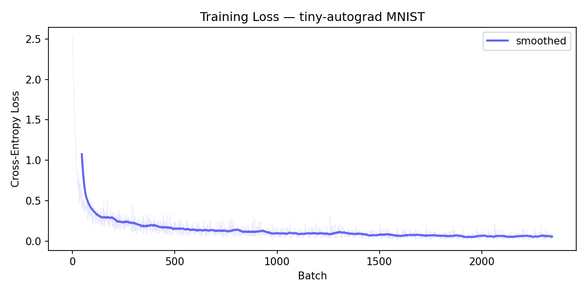
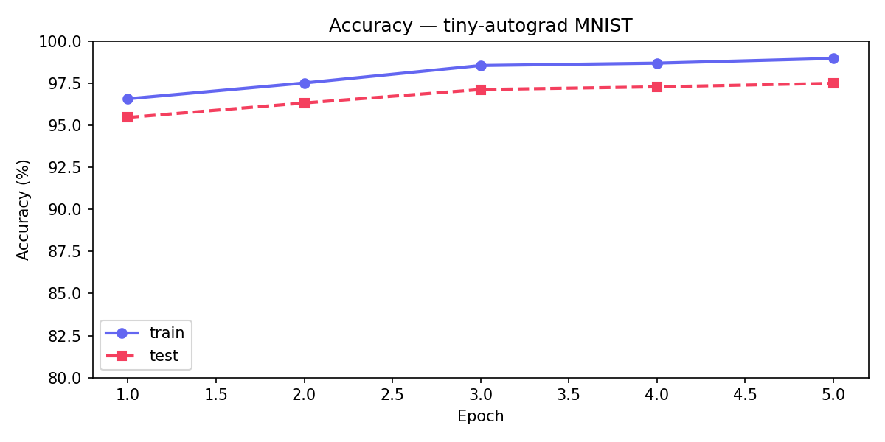

# tiny-autograd

A ~600-line autograd engine with broadcasting support, trained to **97.5% on MNIST**. Built from scratch to understand what PyTorch does under the hood no framework, no magic, just NumPy and the chain rule.

```
epoch 1/5  loss=0.3257  train_acc=96.58%  test_acc=95.47%  (1.2s)
epoch 2/5  loss=0.1307  train_acc=97.52%  test_acc=96.33%  (1.2s)
epoch 3/5  loss=0.0940  train_acc=98.56%  test_acc=97.13%  (1.1s)
epoch 4/5  loss=0.0708  train_acc=98.70%  test_acc=97.29%  (1.0s)
epoch 5/5  loss=0.0577  train_acc=98.98%  test_acc=97.50%  (1.0s)
```

## Training Curves

| Loss | Accuracy |
|:---:|:---:|
|  |  |

## What This Demonstrates

- **Reverse-mode automatic differentiation** from first principles — building a computational graph in the forward pass, walking it backward in topological order.
- **Broadcasting-aware gradients.** NumPy happily broadcasts `(10,)` against `(32, 10)` in the forward pass. The backward pass has to un-broadcast — summing gradients along axes that were implicitly expanded. Every binary op routes through `_unbroadcast` to get this right.
- **Fused softmax-cross-entropy** for numerical stability. Autograd-ing through `log(softmax(x))` naively lets `exp()` blow up; the fused version uses the log-sum-exp trick and computes the clean `(softmax - one_hot) / N` gradient directly.
- **A working Adam optimizer** with bias-corrected first and second moments, implemented from the paper.
- **Kaiming initialization** — the difference between a network that trains and one that stalls at chance. The `Linear` layer samples weights from `N(0, sqrt(2/fan_in))` to keep ReLU pre-activations at unit variance.
- **Gradient correctness testing** — every op has a finite-difference check (`test_tensor.py`), comparing analytic and numerical gradients. Float32 tolerance is intentionally loose (3e-3); the goal is catching formula bugs and broadcasting bugs, not chasing ULP precision.

## Comparison with PyTorch

This is a learning tool, not a competitor:

| | **tiny-autograd** | **PyTorch** |
|---|---|---|
| Core engine LoC | ~600 | ~600,000+ |
| MNIST accuracy (same MLP) | 97.5% | ~97.8% |
| Training time (5 epochs, CPU) | ~6s | ~3s |
| Dependencies | NumPy only | CUDA, MKL, etc. |
| Backward ops | 15 | 1,000+ |

100× slower in 600 lines instead of 600k. The accuracy gap is rounding error; the speed gap is what BLAS kernels and graph optimization buy you.

## Project Structure

```
engine.py       — Scalar autograd engine (Value class). Where the project started.
nn.py           — Scalar neural-net layers (Neuron, Layer, MLP, SGD). Built on engine.py.
tensor.py       — Tensor autograd engine (Tensor class). The real engine, with broadcasting.
tensor_nn.py    — Tensor neural-net layers (Linear, Sequential, Adam). Built on tensor.py.
train.py        — Trains a scalar MLP on 2D spirals. Proof that engine.py works.
train_mnist.py  — Trains a tensor MLP on MNIST. Proof that tensor.py works.
test_tensor.py  — Finite-difference gradient checks for every op in tensor.py.
```

## Quick Start

```bash
# Clone and run — only dependency is numpy (+ matplotlib for plots)
git clone https://github.com/YOUR_USERNAME/tiny-autograd.git
cd tiny-autograd

# Run the gradient tests
python test_tensor.py

# Train on MNIST (~6 seconds on CPU)
python train_mnist.py

# Train the scalar engine on spirals
python train.py
```

## Evolution

This project didn't start as a tensor engine. It started as a **scalar autograd** — one `Value` per number, no arrays, no broadcasting.

1. **Scalar engine** (`engine.py`) — Each `Value` holds a single float. Forward ops build a DAG; `backward()` walks it in reverse topological order. Simple and correct, but training anything real takes minutes because every weight is its own Python object.

2. **Scalar neural net** (`nn.py`, `train.py`) — Built `Neuron`, `Layer`, `MLP` on top of `Value`. Trained on a 2D spiral classification problem. Proved the chain rule works; revealed that scalar autograd is fundamentally too slow for anything beyond toy problems.

3. **Tensor engine** (`tensor.py`) — Rewrote the core to wrap NumPy arrays. Same DAG structure, same backward logic, but now a single `Tensor` holds an entire weight matrix. The hard part wasn't the rewrite — it was **un-broadcasting**: making sure gradients flow back to the right shape when NumPy silently expands dimensions in the forward pass.

4. **MNIST** (`tensor_nn.py`, `train_mnist.py`) — Built `Linear`, `Sequential`, `Adam` on the tensor engine and trained a 784→128→64→10 MLP on MNIST. Getting to 97.5% required getting initialization, the fused cross-entropy loss, and Adam all correct simultaneously.

## Design Notes

Things I learned building this, mostly the hard way:

**Why ReLU is cheap.** The backward pass is just `mask * upstream_grad` where `mask = (x > 0)`. No transcendentals, no divisions — a single elementwise multiply. Tanh backward needs `(1 - t²) * grad`, which is still fast but involves a squaring and subtraction that ReLU skips entirely.

**Why initialization matters more than you'd think.** Before Kaiming init, the network trained to ~85% and stalled. With `W ~ N(0, sqrt(2/fan_in))`, it hit 97%+ in 2 epochs. The intuition: if pre-activations explode or vanish at init, gradients do too, and Adam can't fix a gradient that's numerically zero.

**Un-broadcasting is where all the bugs hide.** When you write `logits + bias` where logits is `(32, 10)` and bias is `(10,)`, NumPy broadcasts automatically. But in the backward pass, the gradient arriving at `bias` is shape `(32, 10)` — you need to `sum(axis=0)` to get it back to `(10,)`. Every single binary op needs this, and getting it wrong gives you a wrong gradient that *looks* plausible until you run the numerical checks.

**Fused losses aren't premature optimization.** I initially implemented `softmax` and `cross_entropy` as separate ops and autograd'd through them. It worked on small batches but produced NaN on real data because `exp(logits)` overflows float32 when logits are large. The fused version subtracts `max(logits)` first (the log-sum-exp trick) and never materializes the raw exponentials.

**The scalar→tensor rewrite taught me what abstraction boundaries are for.** The scalar engine is ~130 lines. The tensor engine is ~330 lines. The extra 200 lines are almost entirely about shape — broadcasting, un-broadcasting, `reshape`, `transpose`, `__getitem__`. The actual calculus is identical.

## License

[MIT](LICENSE)
